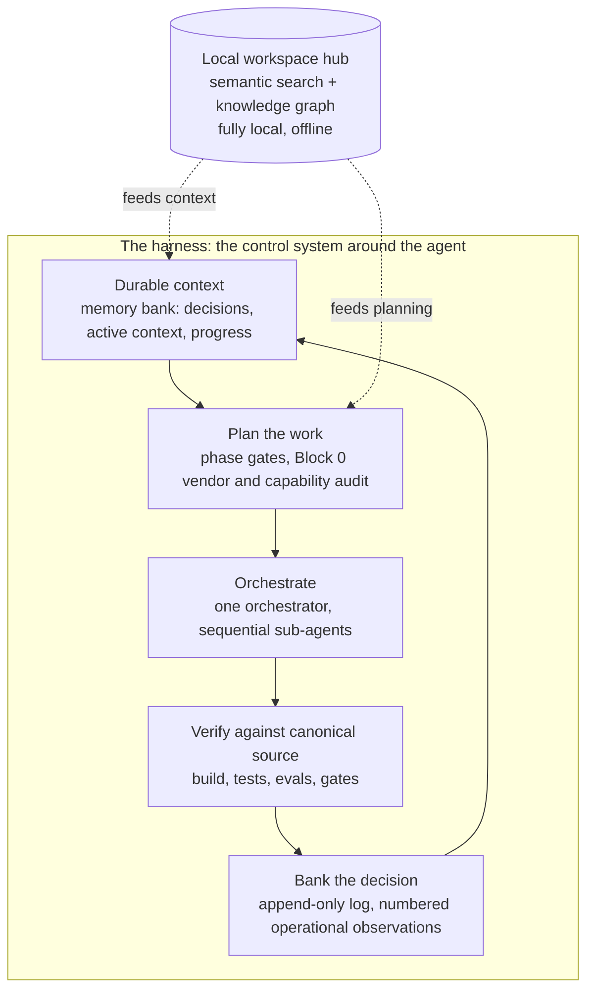

# Agentic Harness

> The operating system I wrap around coding agents to ship and maintain production software. Durable context, decision discipline, orchestrated sub-agents, and verification gates. This is the harness, open source. The products I build with it stay private; the way I build them is here.


I am [Jesse Jolly](https://linkedin.com/in/jessegjolly), solo founder and CTO of [SFX Tech Innovation](https://sfxtechinnovation.com). I ship production AI systems on my own: a patent-pending offline Windows-repair app, a live client-memory SaaS, local-AI desktop tools, and AI automations that run real businesses. This repo is the harness I built to do that with coding agents (AI assistants that write and edit code) and keep doing it as the systems grow.

Anyone can vibe-code a demo in an afternoon. The hard part is shipping something real and then *operating* it for months without it rotting: keeping context durable across sessions, making decisions you can trace and trust, coordinating more work than one agent can hold in its head, and verifying every change against the truth instead of the model's confidence. That gap is the harness. This is mine, generalized and stripped of anything proprietary.

> **In plain terms:** Coding agents can write software quickly, but they forget everything between sessions and will happily claim a job is finished when it is not. This repo is the set of habits and guardrails Jesse puts around an agent so it can build real products and keep them running for months, not just produce a demo. The support system is public here; the products built with it are not.

---

## Contents

- [Install (Claude Code plugin)](#install-claude-code-plugin)
- [Why a harness](#why-a-harness)
- [How it works](#how-it-works)
- [What is in here](#what-is-in-here)
- [The principles, in one breath](#the-principles-in-one-breath)
- [Proven in production](#proven-in-production)
- [Use it](#use-it)
- [Contributing and adapting](#contributing-and-adapting)

---

## Install (Claude Code plugin)

> **In plain terms:** This installs the whole harness into Claude Code (Anthropic's coding tool) with two commands. You get a few preset tool connections over MCP (MCP, or Model Context Protocol, is the standard way an agent reaches outside tools and data), two helper sub-agents (smaller agents the main one hands focused jobs to), and a command that lays down the starting files in your own project. All of it can be changed.

The harness is an installable Claude Code plugin (an add-on you install into the tool). Add the marketplace, install it, reload:

```
/plugin marketplace add SFX-TECH/agentic-harness
/plugin install agentic-harness@sfx-harness
```

You get a clean, key-free MCP loadout (context7, sequential-thinking, filesystem, playwright), a fleet of sub-agents (`advisor`, `code-reviewer`, `block-0-auditor`, `memory-bank-curator`, `ci-watcher`), and a `/harness-init` command that scaffolds the `CLAUDE.md` bootstrap and the memory bank into your own project. Everything is overridable. Full details and customization in [`plugins/agentic-harness/README.md`](plugins/agentic-harness/README.md).

---

## Why a harness

> **In plain terms:** Point a forgetful agent at a real codebase and the same three problems show up every time: it loses track of earlier context, the job grows bigger than it can hold at once, and it sounds certain even when it is wrong. This section names each problem and the fixed practice the harness uses to answer it.

A coding agent is a powerful but forgetful contractor. Point it at a real codebase with no harness and you get three failures, every time:

1. **Context evaporates.** Every session starts cold. Decisions made on Tuesday are re-litigated on Friday, the opposite way.
2. **Work outgrows one context window.** A real change touches more files, more systems, and more verification than a single agent can reason about at once.
3. **Confidence replaces correctness.** The model says it is done. Whether it is done is a separate question that nothing answered.

The harness (the control layer of rules, memory, and checks around the agent) answers each one with a discipline (a fixed practice), not a vibe:

| Failure | Discipline |
|---|---|
| Context evaporates | **Context as code:** a memory bank that is the project's durable brain (decisions, current state, progress) |
| Work outgrows one window | **One orchestrator (one lead agent that coordinates the rest), sequential sub-agents:** decompose, delegate, integrate, never a free-for-all swarm |
| Confidence replaces correctness | **Verify against canonical source:** build, tests, evals, and phase gates are the source of truth, not the model |

---

## How it works

> **In plain terms:** The diagram shows the loop the harness runs around the agent: keep durable memory, plan the work, split and hand out the pieces (orchestration, meaning one lead agent coordinates the others), check the result against the real build and tests, then record what was decided. The agent does the coding; the harness decides what it sees, how the work is divided, and what gets remembered.



The agent does the work. The harness decides what context it gets, how the work is split, how it is checked, and what is remembered. That control system is the difference between a clever demo and software you can run a business on.

---

## What is in here

> **In plain terms:** These are the actual files you can copy, starter templates plus short write-ups of the thinking behind them. Take the templates and you begin from the same setup Jesse uses on every project.

Real, usable scaffolding plus the principles behind it. Copy the templates, keep the conventions, and you have the same backbone I run across every project.

- **[`templates/CLAUDE.md`](templates/CLAUDE.md)**: the project bootstrap every session loads first: locked decisions, current state, behavioral defaults, tooling-invocation defaults, and the anti-patterns to avoid. The single file that makes a fresh agent session start informed instead of cold.
- **[`CONTEXT-AS-CODE.md`](CONTEXT-AS-CODE.md)**: the memory bank: `decisions.md` (append-only architectural log), `active-context.md` (this week only, replaced not appended), `progress.md` (chronological shipped log). Why each exists and how they keep their distinct jobs.
- **[`templates/decisions.md`](templates/decisions.md)**, **[`templates/active-context.md`](templates/active-context.md)**, **[`templates/progress.md`](templates/progress.md)**: drop-in memory-bank templates.
- **[`templates/AUTONOMOUS_LOOP.md`](templates/AUTONOMOUS_LOOP.md)**: the sub-agent orchestration contract: when to spawn, how to spec a sub-agent, the invoke-when matrix, and why sequential beats a swarm under real-world rate limits.
- **[`PRINCIPLES.md`](PRINCIPLES.md)**: the operational principles I bank as I work, each earned from a real failure or a real win. Verify against canonical source. Mechanized safety over remembered safety. Architectural pre-work pays back in iteration count. Discipline is the pace enabler, not its enemy.
- **[`PATTERNS.md`](PATTERNS.md)**: the orchestration patterns: the Block 0 audit, one-orchestrator-plus-sequential-sub-agents, completing a rate-limited sub-agent's remainder, phase-gate discipline.
- **[`WORKSPACE-HUB.md`](WORKSPACE-HUB.md)**: the design of my local workspace hub: a fully offline semantic index and knowledge graph (search by meaning, plus a map of how the pieces connect) over an entire multi-project workspace, exposed to agents over MCP, so any session can retrieve the right context from any project without anything leaving the machine.
- **[`MCP-LOADOUT.md`](MCP-LOADOUT.md)**: the Model Context Protocol servers I run, what each is for, and the rule that governs all of them: prefer the canonical source over the model's memory.

---

## The principles, in one breath

> **In plain terms:** The few working rules that matter most, each one learned from a real success or a real failure. They are the habits that keep the agent honest and the work moving.

The full list lives in [`PRINCIPLES.md`](PRINCIPLES.md). The load-bearing ones:

- **Verify against canonical source.** Documentation states intent. Source code, the live schema, and the API state describe behavior. When they disagree, behavior wins. Read the real thing before you rely on it.
- **Mechanized safety over remembered safety.** A rule a human has to remember fails at 11pm. Move it into a test, a gate, a guard, or a type so it cannot be forgotten.
- **Architectural pre-work pays back in iteration count.** Surfacing a decision before writing the code costs minutes. Surfacing it mid-build costs iterations. Decide first.
- **One orchestrator, sequential sub-agents.** Decompose the work, delegate bounded pieces, integrate the results, own the judgment calls yourself. A swarm that all writes at once is a merge conflict and a rate-limit wall waiting to happen.
- **Discipline is the pace enabler.** The intuition that process slows shipping is wrong at real complexity. The audits and gates catch problems at the cheapest possible moment, which is what lets the work move fast.

---

## Proven in production

> **In plain terms:** Real shipped products built and run this way, not a thought experiment. The code for each stays private, so these link to public showcases that describe them.

This is not a thought experiment. The harness is how I build and operate, solo:

- **SimpleFix AI**: a shipping, fully offline, patent-pending Windows repair app. Thousands of automated tests, a multi-tier repair engine, snapshot-and-undo on every change. [Showcase »](https://github.com/SFX-TECH/simplefixai-showcase)
- **CoachFile**: a live private client-memory SaaS, with AI extraction that cites its sources and never invents. [Showcase »](https://github.com/SFX-TECH/coachfile-showcase)
- **SFX Lead Intelligence Command Center**: a fully local LLM hub and dashboard; answer quality lifted from 61 percent to 99 percent (self-measured) by a ground-truth evaluation harness. [Showcase »](https://github.com/SFX-TECH/sfx-lead-intelligence)
- **CullPilot** and **Local Transcriber**: local-first, on-device AI desktop tools. [CullPilot »](https://github.com/SFX-TECH/cullpilot) · [Local Transcriber »](https://github.com/SFX-TECH/local-transcriber)
- **Production automations for live clients**: operations command centers, growth stacks, and lead-generation pipelines that systematize whole workflows, not just write code.

The products are private and proprietary. The harness that builds them is this repo.

---

## Use it

> **In plain terms:** A short, copy-and-go checklist for adding the harness to your own project. Begin with the starter file, keep the memory updated as a habit, and add the rest as your work grows past what one agent can hold.

The harness is intentionally small and copy-paste friendly:

1. Drop `templates/CLAUDE.md` at your project root and fill in the real decisions and current state.
2. Add the `memory-bank` (decisions, active-context, progress) and make updating it a habit, not an afterthought.
3. Adopt `AUTONOMOUS_LOOP.md` when a task is bigger than one context window.
4. Read `PRINCIPLES.md` and `PATTERNS.md`, then start banking your own. The principles that matter most are the ones you earn.

MIT licensed. Take what is useful, make it yours.

---

## Contributing and adapting

This is an opinionated harness, not a framework seeking feature parity. The most useful contribution is a battle-tested principle or pattern earned from a real ship: open an issue describing the failure it prevents and the discipline that answers it. Bug reports on the templates or the plugin are welcome the same way. Fork it, strip what does not fit, and make it yours, that is the intended use, not a limitation.

---

Built by **Jesse Jolly** · [SFX Tech Innovation](https://sfxtechinnovation.com) · [LinkedIn](https://linkedin.com/in/jessegjolly) · [jessejolly.com](https://jessejolly.com)

*The harness is open source under MIT. The products built with it are private and proprietary. Nothing in this repo includes client data, application source, or patent-method internals.*
